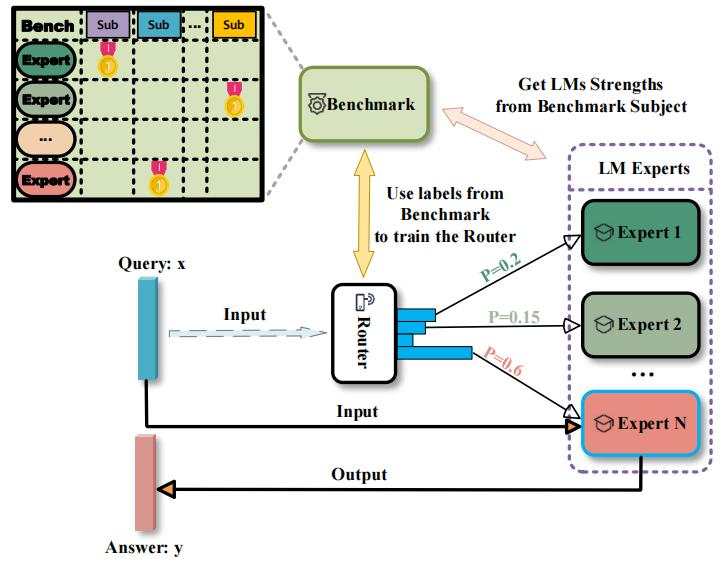

# Bench-CoE: A Framework for Collaboration of Experts from Benchmark

<div align="center">

[]()
[]()

</div>

## 📌 About

Bench-CoE introduces a novel framework for expert collaboration through benchmark-driven approaches. This work pioneers subject-level expert collaboration, moving beyond traditional query-level methods to achieve more efficient and generalizable model cooperation.

<!-- ### Key Contributions

1. **Novel Subject-Level Framework**:
   - First subject-level expert collaboration framework
   - Hierarchical knowledge organization through subject categorization
   - Efficient cross-domain knowledge sharing mechanism

2. **Benchmark-Driven Expert Construction**:
   - Automated expert profiling from benchmark performance
   - Dynamic expert specialization across domains
   - Zero-shot knowledge transfer capabilities

3. **Practical and Scalable Design**:
   - Lightweight implementation without extensive training
   - Flexible integration with existing models
   - Efficient resource utilization -->

## 🔍 Technical Approach



Our framework introduces a simple yet effective approach for expert collaboration:

1. **Subject Router**:
   - BERT-based subject classification
   - Efficient subject-level task distribution
   - Low computational overhead

2. **Expert Models**:
   - Pre-trained LLMs as subject experts
   - No additional training required
   - Direct deployment of existing models

3. **Simple Aggregation**:
   - Straightforward answer selection
   - Lightweight combination strategy
   - Efficient inference process

### Workflow Advantages
- **Simplicity**: Minimal architectural modifications to existing models
- **Efficiency**: Direct utilization of pre-trained models without fine-tuning
- **Scalability**: Easy integration of new expert models
- **Practicality**: Low computational and resource requirements

## 📊 Experimental Journey

Our experimental validation follows a three-stage progressive approach, systematically demonstrating the framework's capabilities:

### Stage 1: Navie Tasks
<details open>
<summary><b>Performance Results</b></summary>


Our framework demonstrates significant improvements on two key benchmarks:

#### MMLU-Pro Performance
- **Best base Model (Gemma-2-9b-it)**: 52.04%
- **Bench-CoE (Subject-Level)**: 52.24% (<span style="color: red">+0.2%</span>)
- **Bench-CoE (Query-Level)**: 64.28% (<span style="color: red">+12.24%</span>)
- Key achievement: Substantial improvement through query-level routing

#### MMMU Performance
- **Best base Model (InternVL2-8B)**: 47.67%
- **Bench-CoE (Subject-Level)**: 51.78% (<span style="color: red">+4.11%</span>)
- Key achievement: Effective subject-level knowledge organization

**Key Findings**:
- Query-level routing shows strong performance on navie tasks
- Subject-level approach demonstrates promising potential
- Significant improvements over state-of-the-art base models

</details>

### Stage 2: In-Distribution Excellence
<details open>
<summary><b>Domain-Specific Performance Analysis</b></summary>

Our framework demonstrates robust performance on in-distribution tasks, validating the effectiveness of both query-level and subject-level approaches:

#### Winogrande Performance
- **Best base Model (Gemma-2-9b-it)**: 66.14%
- **Bench-CoE (Query-Level)**: 67.01% (<span style="color: red">+0.87%</span>)
- Key achievement: Consistent improvement in commonsense reasoning

#### MMMU Performance
- **Best base Model (InternVL2-8B)**: 47.67%
- **Bench-CoE (Subject-Level)**: 50.78% (<span style="color: red">+3.11%</span>)
- Key achievement: Strong performance in multimodal understanding

**Key Findings**:
- Both approaches demonstrate consistent improvements over strong baselines
- **Bench-CoE(Subject-Level)** demonstrates stronger generalization ability and robustness when the distribution between the training and test datasets starts to diverge

</details>

### Stage 3: Out-Distribution Generalization
<details open>
<summary><b>Cross-Dataset Generalization Analysis</b></summary>

Our framework demonstrates strong generalization capabilities across different domains and datasets:

#### Language Task Generalization (MMLU-Pro → BBH)
- **Training**: MMLU-Pro dataset for expert construction
- **Testing**: Big-Bench-Hard (BBH) for out-distribution evaluation
- **Results**:
  * **Best base Model (Mathstral-7B-v0.1)**: 66.35%
  * **Bench-CoE (Subject-Level)**: 69.91% (<span style="color: red">+3.56%</span>)
  * **Bench-CoE (Query-Level)**: 67.07% (<span style="color: red">+0.72%</span>)
- Key achievement: Superior subject-level generalization to complex reasoning tasks

#### Multimodal Task Generalization (MMMU → MMStar)
- **Training**: MMMU dataset for expert construction
- **Testing**: MMStar for cross-domain evaluation
- **Results**:
  * **Best base Model (InternVL2-8B)**: 59.22%
  * **Bench-CoE (Subject-Level)**: 60.09% (<span style="color: red">+0.87%</span>)
  * **Bench-CoE (Query-Level)**: 56.00% (<span style="color: blue">-3.22%</span>)
- Key achievement: Robust subject-level transfer in multimodal scenarios

**Key Findings**:
- Subject-level approach shows superior generalization ability
- Effective knowledge transfer across different task distributions
- Robust performance in both language and multimodal domains
- Demonstrates the scalability of benchmark-driven expert construction

</details>

<!-- 
### Key Insights

1. **Pioneering Subject-Level Framework**:
   - First to propose subject-level expert collaboration beyond traditional query-level approaches
   - Demonstrates superior generalization to out-of-distribution tasks

2. **Progressive Performance**:

   - Excellent performance and Effective cross-domain transfer in both language and multimodal tasks

3. **Practical Efficiency**:
   - Lightweight implementation with minimal computational overhead -->


## 🛠️ Settings

### Environment Setup
- `environment.yml`: Contains a list of Python dependencies and their versions, essential for setting up the development environment.

### Language Models

#### Evaluation Scripts
The scripts in the `/coe_evaluation` directory are designed to evaluate various aspects of trained models:
- `eval_bbh_vllm_query.py`: Evaluates the performance of query-level Bench-CoE on the Big Bench Hard dataset
- `eval_bbh_vllm_subject.py`: Evaluates the performance of subject-level Bench-CoE on the Big Bench Hard dataset
- `eval_hellaswag_vllm_query.py`: Evaluates the performance of query-level Bench-CoE on the hellaswag dataset
- `eval_mmlu_pro_vllm_query.py`: Evaluates the performance of query-level Bench-CoE on the MMLU Pro dataset
- `eval_mmlu_pro_vllm_subject.py`: Evaluates the performance of subject-level Bench-CoE on the MMLU Pro dataset
- `eval_winogrand_vllm_query.py`: Evaluates the performance of query-level Bench-CoE on the Winogrande dataset

### Multimodal Models

#### Evaluation Scripts
- **lmms-eval**: Framework for standardized multimodal evaluation
- **Custom evaluation**: Scripts for specific multimodal tasks (MMMU, SQA)

## 💻 Usage

### Language Models

1. **Setting Up the Conda Environment**
```bash
# Create and activate environment
conda env create -f environment.yml
conda activate bench-coe
```

2. **Downloading Pre-trained BERT Router Models**
```bash
# Clone router model repositories
git clone https://huggingface.co/anonymous/subject_bert_mmlu_pro
git clone https://huggingface.co/anonymous/query_bert_mmlu_pro
git clone https://huggingface.co/anonymous/query_bert_hellaswag
git clone https://huggingface.co/anonymous/query_bert_winogrande
```

3. **Downloading and Setting Up Large Models**
- Download required sub-models to your local environment
- Modify model paths in configuration files accordingly

4. **Downloading Datasets**
- Obtain relevant datasets from Hugging Face
- Ensure dataset compatibility with evaluation requirements

5. **Running Evaluations**
```bash
# BBH Evaluation
python eval_bbh_vllm_query.py     # Query-level evaluation
python eval_bbh_vllm_subject.py   # Subject-level evaluation

# MMLU-Pro Evaluation
python eval_mmlu_pro_vllm_query.py
python eval_mmlu_pro_vllm_subject.py

# Additional Tasks
python eval_hellaswag_vllm_query.py
python eval_winogrand_vllm_query.py
```

### Multimodal Models

#### Evaluation using lmms-eval

1. **Environment Setup**
- Install lmms-eval and required dependencies
- Set up the selected model environment

2. **Model Setup**
- Download pre-trained router model from anonymous/subject_bert_mmmu
- Place `coemodel.py` in `.lmms_eval/models`
- Modify 'AVAILABLE_MODELS' list in `__init__.py`

3. **Running Evaluation**
```bash
CUDA_VISIBLE_DEVICES=0 python3 -m accelerate.commands.launch \
    --num_processes=8 -m lmms_eval \
    --model coemodel \
    --model_args pretrained="None" \
    --tasks name --batch_size 1 \
    --log_samples --log_samples_suffix coemodel \
    --output_path ./logs/
```

#### Custom Evaluation

1. **Environment Setup**
- Install TinyLLaVA_Factory and Bunny
- Prepare required datasets

2. **Model Setup**
- Download pre-trained router model
- Configure model paths and parameters

3. **Running Evaluation**
```bash
CUDA_VISIBLE_DEVICES=0 bash scripts/eval_coe_mmmu.sh
```

### Notes
- Verify all dependencies are correctly installed
- Check GPU memory requirements
- Ensure model paths are properly configured
- If you need to add a model, make modifications according to the loading method of the corresponding model.
## ❤️ Community efforts

* Our model utilizes the [bert-base-uncased](https://huggingface.co/google-bert/bert-base-uncased). We extend our gratitude to the Hugging Face community for providing open access to this foundational technology, which has significantly propelled our research and development efforts.
* Our multimodal model experiments is built upon the [lmms-eval](https://github.com/EvolvingLMMs-Lab/lmms-eval) project. Great work!

## 📚 Citation
```bibtex
@inproceedings{anonymous2025bench,
  title={Bench-CoE: A Framework for Collaboration of Experts from Benchmark},
  author={},
  booktitle={Arxiv},
  year={2025}
}
```
